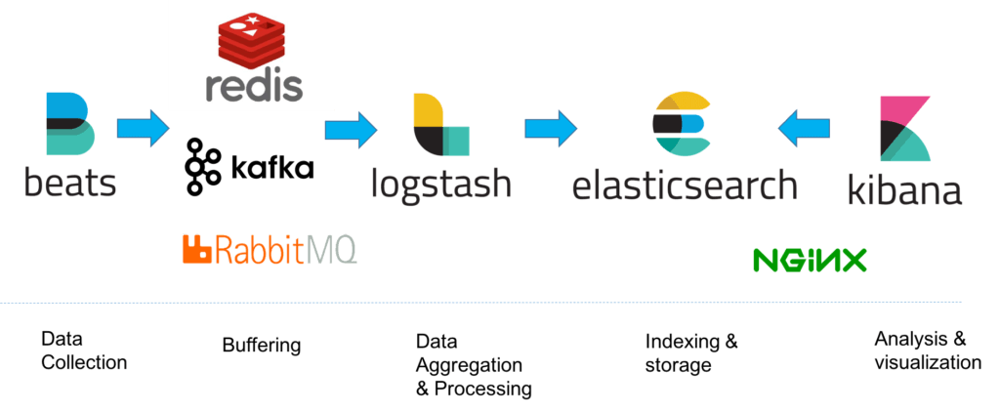

# ELK使用

- Elasticsearch，提供存储、查询功能。基于JsON的分布式搜索与分析引擎。
- Logstash，提供数据收集功能。将事务处理数据库数据加载到数据合库中。
- Kibana，数据的可视化平台
- 消息缓存队列，解决数据安全与均衡Elasticsearch、Logstash的负载压力。



[ELK architecture](https://logz.io/wp-content/uploads/2018/08/image6-1024x422.png)

资源配置

| 主机              | IP      | 描述              | 版本     |
|-----------------|---------|-----------------|--------|
| elasticsearch-1 | xx:9200 | es集群            | 8.10.3 |
| elasticsearch-2 |         | es集群            |        |
| elasticsearch-3 |         | es集群            |        |
| kibana          |         | logstash+kibana |        |
| web             |         | nginx+filebeat  |        |

#### 使用场景

1. 收集nginx请求数据
2. 收集日志数据
3. 收集系统内所有数据

#### 示例:实现商品搜索

增：根据id查询数据库将商品信息添加到Es:导入所有商品信息到ES;
删：根据id删除Es商品信息
改：
查：原生client查询较复杂，使用spring.data提供的ElasticsearchRestTemplate简单一点。

## ELK部署（docker-compose）

目录：/mnt/d/program/src/github/java-examples/docker

```sh
cd /mnt/d/program/src/github/java-examples/docker

# 拉取镜像
docker pull m.daocloud.io/elasticsearch:7.17.15
docker pull m.daocloud.io/logstash:7.17.15 
docker pull m.daocloud.io/kibana:7.17.15
docker tag m.daocloud.io/elasticsearch:7.17.15 elasticsearch:7.17.15
docker tag m.daocloud.io/logstash:7.17.15 logstash:7.17.15
docker tag m.daocloud.io/kibana:7.17.15 kibana:7.17.15
# 创建挂载目录
sudo mkdir -p /mydata/elasticsearch/data /mydata/elasticsearch/plugins /mydata/elasticsearch/config
sudo chmod 777 /mydata/elasticsearch/data
sudo chmod 777 /mydata/elasticsearch/config
sudo chmod 777 /mydata/elasticsearch/plugins

sudo mkdir -p /mydata/logstash
sudo chmod 777 /mydata/logstash

#创建网络
docker network create es-net

# 启动
docker-compose up -dw
# 停止镜像、删除容器
docker-compose down
```

## Elasticsearch

[Elastic官方文档-使用Docker安装](https://www.elastic.co/guide/en/elasticsearch/reference/7.17/docker.html)

在生成环境使用：

1. 设置 `vm.max_map_count` 至少为 `262144` 。

```sh
# 查看vm.max_map_count，限制一个进程可以拥有的VMA（虚拟内存区域）的数量
sudo sysctl -a | grep vm.max_map_count
# 设置
sudo sysctl -w vm.max_map_count=262144
```

2. 确保elasticsearch挂载目录有读写权限
3. 建议生产环境由ES自动调整JVM堆大小，ES会根据节点的角色和可用总内存自动调整JVM堆大小。在测试环境可以使用 `ES_JAVA_OPTS`
   环境变量手动设置堆大小为512MB。
4. 设置容器挂载目录持久化数据目录 `/usr/share/elasticsearch/data` 。

遇到的问题：

1. 【未解决】虚拟机可以访问，宿主机无法访问 `localhost:9200`
   。有博客说Docker容器默认以bridge网络运行，此时主机与容器网络不同，但是映射了端口应该是正常才对。以host网络模式运行docker容器，可以访问。 `--network=host`
   。但这种方式是错误的，无法在docker-compose中使用。

​ 暂不明白为什么，同样的操作在Linux上没问题。感觉是WSL网络哪有问题。

​

2. 【已解决】docker启动elasticsearch后，es一直在restart，使用 `docker logs -f <container>`
   查看日志，发现 `/usr/share/elasticsearch/config`
   目录挂载有问题。搜索解决方案为，先去除config的自动挂载，启动后手动挂载 `docker cp <container>:/usr/share/elasticsearch/config 自己挂载目录`
   ，然后停止删除容器，重新运行就可以了。

使用docker部署单节点集群进行开发或测试

```sh
#拉取镜像
docker pull m.daocloud.io/elasticsearch:7.17.15
docker tag m.daocloud.io/elasticsearch:7.17.15 elasticsearch:7.17.15

#创建网络
docker network create es-net

#创建挂载目录
sudo mkdir -p /mydata/elasticsearch/data /mydata/elasticsearch/plugins /mydata/elasticsearch/config
sudo chmod 777 /mydata/elasticsearch/data
sudo chmod 777 /mydata/elasticsearch/config
sudo chmod 777 /mydata/elasticsearch/plugins

# 创建ES容器，单点部署
docker run -d \
  --name es \
  --restart=always \
  --network=host \
  -p 9200:9200 \
  -p 9300:9300 \
  -v /mydata/elasticsearch/config:/usr/share/elasticsearch/config \
  -v /mydata/elasticsearch/data:/usr/share/elasticsearch/data \
  -v /mydata/elasticsearch/plugins:/usr/share/elasticsearch/plugins \
  -e "cluster.name=elasticsearch" \
  -e "discovery.type=single-node" \
  -e "ES_JAVA_OPTS=-Xms512m -Xmx512m" \
  elasticsearch:7.17.15

# 修改elasticsearch.yml，关闭密码安全验证。（非必要）
docker exec -it es /bin/bash 
cd config
echo 'xpack.security.enabled: false' >> elasticsearch.yml

# 重启Es容器
docker restart es

# 终止容器
docker stop es && docker rm es

# 测试
curl localhost:9200
```

使用docker-compose部署***多节点***集群

```sh
#创建挂载目录
sudo mkdir -p /mydata/es-cluster
sudo chmod 777 /mydata/es-cluster

# docker-compose.yml
version: '3'
services:
  es01:
    image: elasticsearch:7.17.15
    container_name: es01
    environment:
      - node.name=es01
      - cluster.name=es-docker-cluster
      - discovery.seed_hosts=es02,es03
      - cluster.initial_master_nodes=es01,es02,es03
      - bootstrap.memory_lock=true
      - "ES_JAVA_OPTS=-Xms512m -Xmx512m"
    ulimits:
      memlock:
        soft: -1
        hard: -1
    volumes:
      - data01:/usr/share/elasticsearch/data
    ports:
      - 9200:9200
    networks:
      - elastic
  es02:
    image: elasticsearch:7.17.15
    container_name: es02
    environment:
      - node.name=es02
      - cluster.name=es-docker-cluster
      - discovery.seed_hosts=es01,es03
      - cluster.initial_master_nodes=es01,es02,es03
      - bootstrap.memory_lock=true
      - "ES_JAVA_OPTS=-Xms512m -Xmx512m"
    ulimits:
      memlock:
        soft: -1
        hard: -1
    volumes:
      - data02:/usr/share/elasticsearch/data
    networks:
      - elastic
  es03:
    image: elasticsearch:7.17.15
    container_name: es03
    environment:
      - node.name=es03
      - cluster.name=es-docker-cluster
      - discovery.seed_hosts=es01,es02
      - cluster.initial_master_nodes=es01,es02,es03
      - bootstrap.memory_lock=true
      - "ES_JAVA_OPTS=-Xms512m -Xmx512m"
    ulimits:
      memlock:
        soft: -1
        hard: -1
    volumes:
      - data03:/usr/share/elasticsearch/data
    networks:
      - elastic

volumes:
  data01:
    driver: local
  data02:
    driver: local
  data03:
    driver: local

networks:
  elastic:
    driver: bridge
```

安装IK分词器

```sh
docker exec -it elasticsearch /bin/bash
./bin/elasticsearch-plugin install https://github.commedcl/elasticsearch-analysis-ik/releases/dowmload/v7.17.15/elasticsearch-analysis-ik-7.17.15.zip
```

## Logstash

```shell

```

## Kibana

```shell
docker pull kibana:7.17.15

mkdir-p /usr/local/kibana/config /usr/local/kibana/data
chmod 777 /usr/1oca1/kibana/data
chmod 777 /usr/local/kibana/config

docker run -d \
  --name kibana \
  --restart=always \ 
  --network es-net \
  -p 5601:5601 \
  -e ELASTICSEARCH_HOSTS=http://es:9200 \
  kibana:8.6.0

# 测试
http://192.168.27.129:5601
```